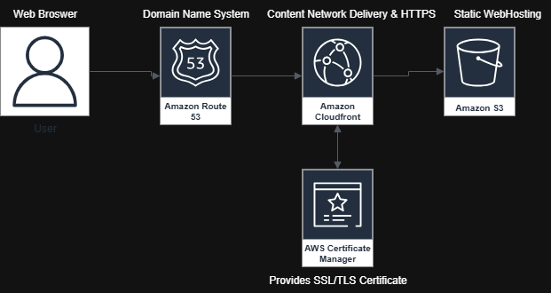
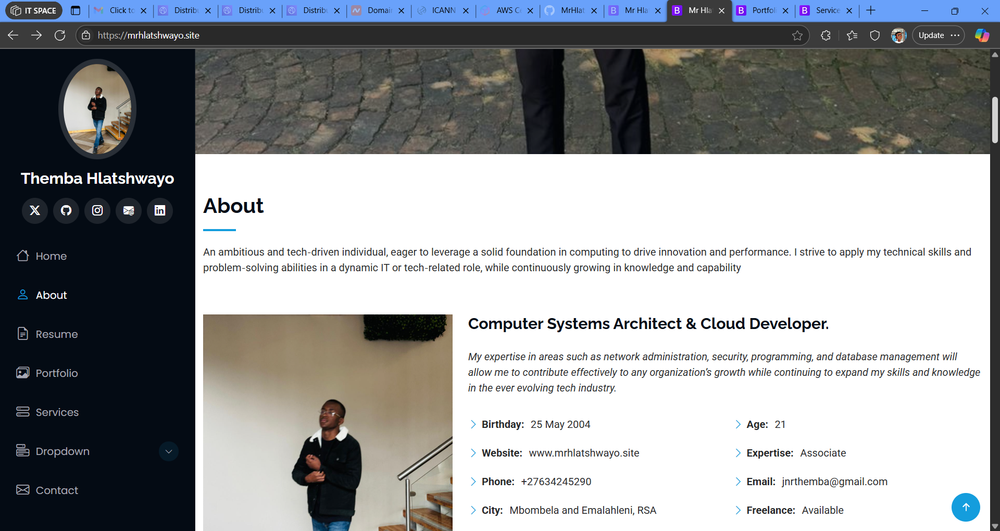

# portfolio-website
My personal portfolio website hosted on AWS S3 with CloudFront and Route 53 for custom domain and SSL.
Showcasing my skills, projects, and resume.  
Hosted entirely on AWS with high availability and security.

---

## Live Demo
🔗 [View My Portfolio](https://www.mrhlatshwayo.site)

---

## Architecture Overview

**Services Used**
- **Amazon S3** → Static website hosting  
- **Amazon CloudFront** → Global CDN with HTTPS  
- **AWS Certificate Manager** → Free SSL/TLS certificate  
- **Amazon Route 53** → Custom domain and DNS routing  

---

## Features
- Responsive HTML5/CSS3 design  
- Fast and secure delivery with CloudFront  
- HTTPS enabled using SSL/TLS  
- Custom domain via Route 53  
- Showcase of projects and resume  

---

## Project Structure
portfolio-website/
│
├── assets/ # CSS, JS, images
├── index.html # Main homepage
└── README.md # Documentation
└── portfolio-details.html # Projects Page
└── service-details.html # Services Page
└── books page.html # Books Page
└── values and beliefs.html # Personal Story and Values
└── forex and finance.html # Trading Analytics
---

## 🚀 Deployment Guide
1. Create an **S3 bucket** with static website hosting enabled.  
2. Upload your website files.  
3. Configure **CloudFront** with the S3 bucket as origin.  
4. Request a certificate from **AWS Certificate Manager**.  
5. Point your custom domain to CloudFront using **Route 53**.  

---

## 📸 Screenshots

---

## 📬 Contact
For inquiries: **jnrthemba@gmail.com**
